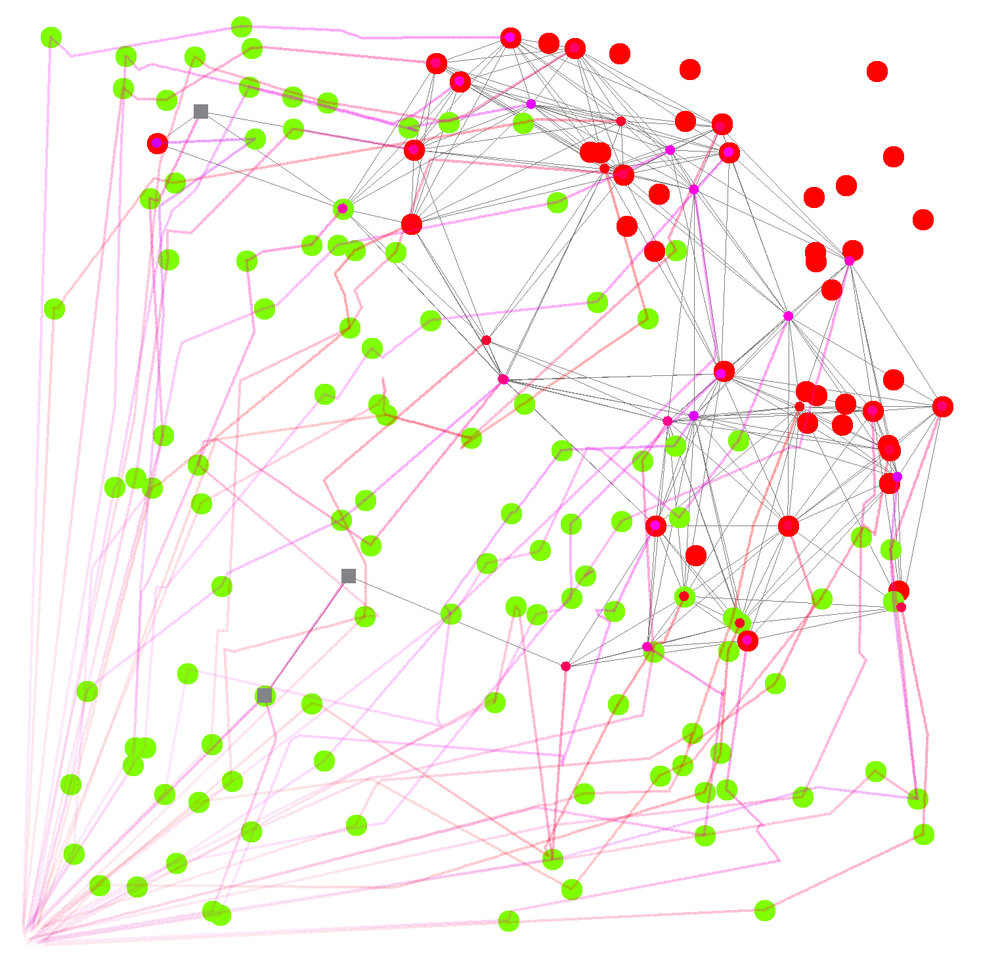
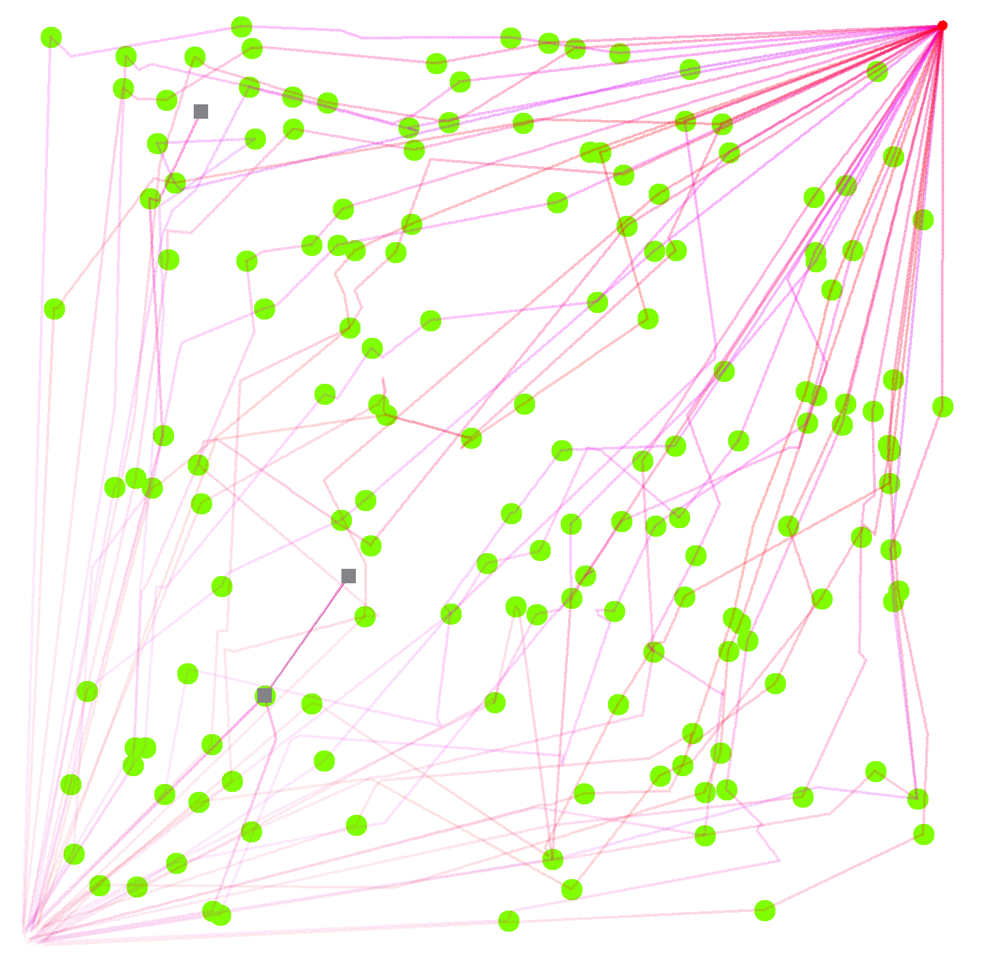

# _A Field-based Approach for Runtime Replanning in Swarm Robotics Missions_

### Authors

Anonymized for double-blind review

### Table of Contents
- [About](#about)
    * [Experiments](#experiments)
- [Getting Started](#getting-started)
    - [Requirements](#requirements)
    - [Limitations](#limitations)
    - [Understanding the experiments](#understanding-the-experiments)
    - [Walk-through the experiments](#walk-through-the-experiments)
    - [Reproduce the entire experiment](#reproduce-the-entire-experiment)
        * [Simulation Graphical Interface](#simulation-graphical-interface)
        * [Extremely quick-start of a basic experiment -- `(ba|z|fi)?sh` users only](#extremely-quick-start-of-a-basic-experiment----bazfish-users-only)
        * [Reproduce the experiments through Gradle](#reproduce-the-experiments-through-gradle)
        * [Changing experiment's parameters](#changing-experiments-parameters)
        * [Simulation entrypoint](#simulation-entrypoint)
        * [Experiments features recap](#experiments-features-recap)


## About

Ensuring mission success for multi-robot systems operating
in unpredictable environments requires robust mechanisms to react to unpredictable events,
such as robot failures, by adapting plans in real-time.
Adaptive mechanisms are especially needed for large teams deployed in areas with unreliable network infrastructure,
for which centralized control is impractical and where network segmentation is frequent.

This work advances the state of the art by proposing a field-based runtime replanning approach grounded in aggregate programming.
Through this paradigm,
the mission and the environment are represented by continuously evolving fields,
enabling robots to make decentralized decisions and collectively adapt the ongoing plan.

We compare our approach with a simple late-stage replanning strategy
and an oracle-supported centralized continuous replanner.
We provide experimental evidence that the proposed approach achieves performance close to the oracle if the communication range is enough,
while significantly outperforming the baseline even under sparse communication.
Additionally, we show that the approach can scale well with the number of robots.

### Experiments

This repository contains the source code for the experiments presented in the paper
"_A Field-based Approach for Runtime Replanning in Swarm Robotics Missions_".

The primary goals of the experiments are:
- **Resilience Assessment**: verify whether the proposed field-based replanning approaches adapt to robot failures, 
    ensuring mission completion despite unforeseen disruptions.
- **Scalability Analysis**: investigate how the number of robots and tasks affect the system performance.

Some snapshots of the experiments are shown below.
Tasks are represented by red dots, which turn green when completed.
Pink lines show robot trajectories,
gray boxes mark inactive/failed robots.
Gray lines show direct communication lines between robots.
See the [Understanding the experiments](#understanding-the-experiments) section for a detailed explanation of the images.

|                                                                  |                                                          |
|:--------------------------------------------------------------------------------------------------------------:|:------------------------------------------------------------------------------------------------------------:|
|                     Distrubution of tasks with robot that have just started their mission.                     |                Tasks completion after some time, showing robot trajectories and failures too.                |
|                                                             |                                            |
| Completed tasks are marked in green, it can be seen that some robots went back to complete some missing tasks. | Mission completed, highlighting all the trajectories and all the robots that have failed during the mission. | 

## Getting started

### Requirements

In order to successfully download and execute the graphical experiments are needed:
- Internet connection;
- [Git](https://git-scm.com);
- Linux, macOS and Windows systems capable of running [Java](https://www.oracle.com/java/technologies/javase/jdk19-archive-downloads.html) 17 (or higher);
- 1GB free space on disk;
- GPU with minimal OpenGL capabilities (OpenGL 2.0);
- 4GB RAM.

### Limitations

- The experiments run in "batch mode" generate a lot of data,
  and the simulation may take a long time to finish (up to several hours) even with high-performance computers.
  We suggest running the experiments in "graphic mode" to have a better understanding of the simulation;
- On different monitor types with different resolutions, the graphical interface could appear a bit different;
- For GUI interpretation, please refer to the [Simulation Graphical Interface](#simulation-graphical-interface) section.

### Understanding the experiments

The experiments are the following:
- _depotsBaseline_: where the replanning is done at the end of the mission, after all robots have completed their tasks;
- _depotsOracle_: the replanning is centralized, there is an oracle that knows the state of the environment and the robots,
  once a node fails, there is a server that replans the mission and sends the new plan to the robots;
- _depotsRuntime_: our proposed field-based runtime replanning approach,
  where robots are able to adapt their plan in real-time based on the current state of the environment. 
  This approach has two different types of coordination:
    - leader-based: where a leader is elected in a distributed and adaptive way (resilient to failures),
        and is responsible for deciding the plan for all the robots;
    - gossip-based: creates a global state of the system in a distributed way, then replans the mission based on the global state.

The mentioned experiments have just three nodes that fail during the mission,
at different times.
Meanwhile, the ones named with the suffix _RandomFailure_ are the same as the ones without the suffix,
but in addition, every robot has a negative exponential probability of failure during the mission.

### Walk-through the experiments

This section provides a brief overview of the _depotsRuntime_ experiment with the leader-based coordination,
to give an idea of how the experiments work.
The _depotsRuntime_ experiment, has as default parameters:
- 20 robots;
- task factor of 4 (i.e., 80 tasks);
- full communication range (i.e., robots can communicate with all other robots);
- 

The detailed instructions to reproduce the experiment are in the section "[Reproduce the entire experiment](#reproduce-the-entire-experiment)".

The simulation can be launched with the command `./gradlew run`,
or the one in the section "[Extremely quick-start](#extremely-quick-start-of-a-basic-experiment----bazfish-users-only)".
Once the simulation has started, the Alchemist GUI will open.
After the time needed for Alchemist to load the simulation,
it will show the initial structure,

For more details of the simulation (e.g., the appearance, the meaning of the different shapes, etc.)
see section [Understanding the experiments](#understanding-the-experiments).
Now the simulation can be started by pressing the <kbd>P</kbd> key on the keyboard.
By pressing the <kbd>P</kbd> key again, the simulation will pause (and resume).
When the simulation starts,
if you wish to execute it at "real time" speed,
press the <kbd>R</kbd> key (and again to return to the fast speed).
For other features of the GUI, please refer to the [Simulation Graphical Interface](#simulation-graphical-interface) section.


### Reproduce the entire experiment

**WARNING**: re-running the whole experiment may take a very long time on a normal computer.

#### Simulation Graphical Interface

The simulation environment and graphical interface are provided by [Alchemist Simulator](https://alchemistsimulator.github.io/index.html).
To understand how to interact with the GUI,
please refer to the [Alchemist documentation](https://alchemistsimulator.github.io/reference/swing/index.html#shortcuts).

#### Extremely quick-start of a basic experiment -- `(ba|z|fi)?sh` users only

- Requires a Unix terminal (`(ba|z|fi)?sh`)
- `curl` must be installed
- run:
```bash
curl https://raw.githubusercontent.com/angelacorte/experiments-2025-acsos-robots/master/runtime-replanning-leader-based.sh | bash 
``` 
- the repository is in your `Downloads` folder for further inspection.

#### Reproduce the experiments through Gradle

1. Install a Gradle-compatible version of Java.
   Use the [Gradle/Java compatibility matrix](https://docs.gradle.org/current/userguide/compatibility.html) to learn which is the compatible version range.
   The Version of Gradle used in this experiment can be found in the gradle-wrapper.properties file located in the gradle/wrapper folder.

2. Open a terminal

3. Clone this repository on your pc with `git clone https://github.com/angelacorte/experiments-2025-acsos-robots`.

4. Move into the root folder with `cd experiments-2025-acsos-robots`
5. Depending on the platform, run the following command:
    - Bash compatible (Linux, Mac OS X, Git Bash, Cygwin): ``` ./gradlew run<ExperimentName>Graphic ```
    - Windows native (cmd.exe, Powershell): ``` gradlew.bat run<ExperimentName>Graphic ```
6. Substitute `<ExperimentName>` with the name of the experiment (in PascalCase) specified in the YAML simulation file.
   Or execute ```./gradlew tasks``` to view the list of available tasks.

The corresponding YAML simulation files to the experiments cited above are the following:
- _ ?????_:  ```./gradlew runLegacySelfConstructionGraphic```,
- 
**NOTE:**
The tasks above *in graphic mode* will run the experiments with the default parameters.

#### Changing experiment's parameters
To change the parameters of the experiments, you can modify the **YAML** files located in the `src/main/yaml` folder.
The parameters that can be changed are:

Each change in the parameters will result in a different structure generated by the simulation.
The parameters provided in the YAML files are the ones used for the evaluation and the ones evaluated as "optimal."

For further information about the YAML structure,
please refer to the [Alchemist documentation](https://alchemistsimulator.github.io/reference/yaml/index.html).

#### Simulation entrypoint


## // TODO: from below, take the content for the plotting and remove the rest.
# Experiments 2025 ACSOS robots

A customized Alchemist Primer with releases and data analysis ready.

Upon generation of an experiment from this template:
1. add a secret github token with `repo` permissions named `DEPLOYMENT_TOKEN`;
2. edit the project name in `settings.gradle.kts`;
3. edit the DockerHub user name in `docker-compose.yml`;
4. add a secret called `DOCKER_PASSWORD` with your DockerHub password;
5. edit the DockerHub password in `.github/workflows/build-and-deploy.yml`;

## Reproduce the entire experiment

**WARNING**: re-running the whole experiment may take a very long time on a normal computer.

### Reproduce with containers (recommended)

1. Install docker and docker-compose
2. Run `docker-compose up`
3. The charts will be available in the `charts` folder.

### Reproduce natively

1. Install a Gradle-compatible version of Java.
  Use the [Gradle/Java compatibility matrix](https://docs.gradle.org/current/userguide/compatibility.html)
  to learn which is the compatible version range.
  The Version of Gradle used in this experiment can be found in the `gradle-wrapper.properties` file
  located in the `gradle/wrapper` folder.
2. Install the version of Python indicated in `.python-version` (or use `pyenv`).
3. Launch either:
    - `./gradlew runAllBatch` on Linux, MacOS, or Windows if a bash-compatible shell is available;
    - `gradlew.bat runAllBatch` on Windows cmd or Powershell;
4. Once the experiment is finished, the results will be available in the `data` folder. Run:
    - `pip install --upgrade pip`
    - `pip install -r requirements.txt`
    - `python process.py`
5. The charts will be available in the `charts` folder.

## Inspect a single experiment

Follow the instructions for reproducing the entire experiment natively, but instead of running `runAllBatch`,
run `runEXPERIMENTGraphics`, replacing `EXPERIMENT` with the name of the experiment you want to run
(namely, with the name of the YAML simulation file).

If in doubt, run `./gradlew tasks` to see the list of available tasks.

To make changes to existing experiments and explore/reuse,
we recommend to use the IntelliJ Idea IDE.
Opening the project in IntelliJ Idea will automatically import the project, download the dependencies,
and allow for a smooth development experience.

## Regenerate the charts

We keep a copy of the data in this repository,
so that the charts can be regenerated without having to run the experiment again.
To regenerate the charts, run `docker compose run --no-deps charts`.
Alternatively, follow the steps or the "reproduce natively" section,
starting after the part describing how to re-launch the simulations.
